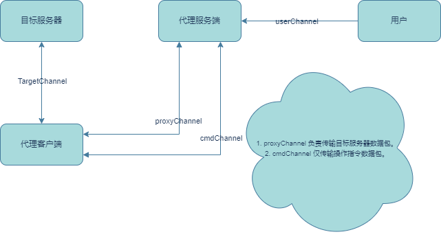

# NAT PROXY Introduction
Natproxy是一个内网穿透工具，可以使个人计算机或局域网上的服务器连接到公网上，且同时支持TCP/UDP流量转发以及其上层TCP协议（如`SSH`、`HTTP/HTTPS`...）。

# 快速入门
> main分支为自定义协议
> 
> **proto3协议需切换proto3分支**

**下载与构建**

```shell
git clone https://github.com/PonKing66/natproxy
cd natproxy
mvn clean package -Dmaven.test.skip=true
```

**运行步骤**

1. 进入 ../build/natproxy 目录
2. 在代理客户端上运行客户端
3. 在代理服务器上运行服务器

**详细配置**

代理客户端配置

```yaml
server:
  host: 127.0.0.1 # 代理服务器 IP
  port: 20001 # 代理服务器端口
client:
  key: 721b2e485683bd87c32f3c208f787a626c7397a759146a93be30e15ad3193084 # 认证客户端 key
```

代理服务器配置

```yaml
server:
  port: 20001 # 代理服务器端口
  keys:
    - 721b2e485683bd87c32f3c208f787a626c7397a759146a93be30e15ad3193084 # 合法登录客户端 Key，与代理客户端配置中的相同
  proxy:
    - host: 192.168.31.96 # 目标服务器 IP
      intranetPort: 22 # 被代理端口（目标服务器端口）
      extranetPort: 22222 # 代理服务器暴露端口（用户访问端口）
      type: tcp # 代理转发协议
      key: 721b2e485683bd87c32f3c208f787a626c7397a759146a93be30e15ad3193084 # 指定开启代理客户端
    - host: 192.168.31.96
      intranetPort: 3306
      extranetPort: 33006
      type: tcp
      key: 721b2e485683bd87c32f3c208f787a626c7397a759146a93be30e15ad3193084
    - host: 192.168.31.96
      intranetPort: 44444
      extranetPort: 55555
      type: udp
      key: 721b2e485683bd87c32f3c208f787a626c7397a759146a93be30e15ad3193084
```

# 代理原理



# 致谢

特别感谢 [p2p-nat](https://gitee.com/TANGMONK-MEAT/p2p-nat) 参考与启发
